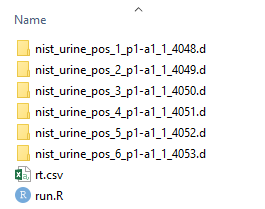

# Met4DX

## Introduction
`Met4DX` is an R package for timsPro 4D data processing.

The docker image zhulab/mettracer-r contains entire envorienment for running `Met4DX`. For convinience and taking fully use of `Met4DX`, users can pull it and run `Met4DX` just as following.

## What is Met4DX

`MetT4DX-r` is a Docker environment to processing isotope labelled metabolomics data with #Met4DX R package. It is based on the [`r-base`](https://hub.docker.com/_/r-base/) docker.

## Pulling image

Users can pull the MetTracer-r image with the following script

```bash
docker pull zhulab/met4dx-r
```

## Data preparation

The data folder should contain raw data files (.d), and script and RT recalibration table (optional). Demo files could be downloaded from [`https://doi.org/10.5281/zenodo.7215544`](https://doi.org/10.5281/zenodo.7215544).
- raw data files (.d): the .d files containing .mgf file converted from DataAnalysis. If the samples contained different experimental conditions and groups, corresponding sub-folder could be built in the root folder.
- RT recalibration table: the table recording to the experimental RT values of RTQC sample, required for multidimenal match, and details could be found in our published protocol. [`http://metdna.zhulab.cn/metdna/help#2.6`](http://metdna.zhulab.cn/metdna/help#2.6).

- 

## R script preparation
To run the data processing, an R script named [run.R](extra/run.R) should be placed in the data folder.
Here we provide an example. Users only need to change RT range,  ion mode and reference sample in the RT alignment step. Other parameters are recommended parameters.
- Import parameters
  - rt_range: retention time range in second
  - ion_mode: 'positive' or 'negative'
  - snthreshold: the S/N threshold during peak detection
  - peak_span_eim: minimum points to find a EIM. The whole mobility range was divided into 1000 portions, and user could set the peak span according to the observed peak width of EIM.
  - peak_span_eic:  minimum points to find a EIC, the unit is point. User can set the peak span according to the observed peak width and cycle time of EIC.
  - ref_sample: reference sample for landmark-based RT alignment. we recommend to used the QC sample or the middle sample in the injection order

```R
library(Met4DX)
wd <- '.'
setwd(wd)

### read the spectra ####
exp <- Experiment(wd = wd, nSlaves = 6, rt_range = c(0, 725), lc_column = 'HILIC', ion_mode = 'negative')
tims_data <- TimsData(exp)
param <- ReadSpectraParam(intensity_from = "ms2_intensity",
                          rerun = F)
tims_data <- ReadSpectraData(tims_data, param)

### MS2 spectral dereplication ####
param <- BinPrecursorParam(rerun = F)
tims_data <- BinPrecursors(tims_data, param)


### Query MS1 data frame ####
param <- QueryTimsDataParam(rerun = F)
tims_data <- QueryTimsData(tims_data, param)


### bottom-up assembly peak detection #####
param <- ExtractIMDataParam(rerun = F,
                            smooth_method = 'loess',
                            snthreshold = 3,
                            smooth_window_eim = 15,
                            order_column = "intensity",
                            peak_span_eim = 13,
                            peak_span_eic = 11, 
                            keep_profile = T)
tims_data <- ExtractIMData(tims_data, param)
param <- DereplicatePeaksParam(rerun = F, match_msms = F)
tims_data <- DereplicatePeaks(tims_data, param)

### RT alignment #####
param <- CorrectRTLandmarksParam(rerun = F, ccs_tol = 2)
tims_data <- CorrectRT(tims_data, param, ref_sample = "nist_urine_neg_1_p1-a1_1_4095.d")

### peak grouping ####
param <- GroupDensityParam(rerun = F, plot_density = F, mz_bin_size = 0.015)
dereplication_param <- DereplicatePeaksParam(mz_tol = 0.015/2, mobility_tol = 0.015/2, rt_tol = 5, rerun = F, order_column = 'area')
tims_data <- GroupPeaks(tims_data, param, dereplication_param)

### match sample between runs ####
param <- MatchBetweenRunParam(rerun = F, 
                              peak_span_eim = 13,
                              peak_span_eic = 11)
tims_data <- MatchBetweenRuns(tims_data, param)

### finalize feature tbale ####
param <- FinalizeFeatureParam(rerun = F,
                              col_max = 'target_intensity')
tims_data <- FinalizeFeatures(tims_data, param)

### peak filling ####
param <- FillPeakParam(rerun = F)
tims_data <- FillPeaks(tims_data, param)

### metabolite identification ####
param <- SearchParam(typeCCS = 'percentage',
                     toleranceCCS = c(3,6),
                     toleranceRT = c(30, 90))
match_para <- MatchParam(methodMatch = 'direct',
                         methodScore = 'dp',
                         intensityNormedMethod = 'maximum',
                         cutoff = 0.8)
combine_para <- CombineParam(scoreMSMS = 'reverse')
tims_data <- IdentifyPeaks(tims_data,
                           param,
                           match_para,
                           combine_para,
                           rt_exp_file = './rt.csv',  # if RT calibration file is provided
                           demo_mode = TRUE)
```

## Run data processing work with met4dx-r image

- go to your data folder (e.g., data)

```base
 cd data
```

- run docker using following code (*User should be permitted to run docker service*)

```bash
# MUST keep the code exactly as it is!
docker run -it --rm -v "$PWD":/data -u $(id -u ${USER}):$(id -g ${USER}) zhulab/met4dx-r Rscript run.R
```

- wait till data processing work done

- Explaining `docker run` arguments

- `-v "$PWD":/home/${USER}`: mapping current directory as home directory in docker container

- `-u $(id -u ${USER}):$(id -g ${USER})`: using current user to run the container

- `Rscript ~/run.R`: run run.R in container home directory with `Rscript`  command

## The result 

After the data processing work done, a folder name 'results' would be generated in the root folder. 


The main results is listed following:
- feature table named "features_filled.csv"
- MS2 spectral file named "spectra.msp" 
- the multidimensional match result named "result3_ScoreCombine_refined_level.csv"
- an intermediate data called "spec_searched", containing m/z, RT and CCS match candidates to run MS-FINDER (version 3.24).

To run additional MSFinder filtering, users can run the demo [scripts we](extra/ForMSFinder/combine_final_result.R) and [MSFinder parameters](extra/ForMSFinder/MsfinderConsoleApp-Param.txt) provided here under Windows OS.
After running MS-FINDER and combining with "result3_ScoreCombine_refined_level.csv", users could obtain the final multidimensional match result named "ScoreCombine.csv" with the provided R script.
 
# License
<a rel="license" href="https://creativecommons.org/licenses/by-nc-nd/4.0/"></a>

This work is licensed under the Attribution-NonCommercial-NoDerivatives 4.0 International (CC BY-NC-ND 4.0)
