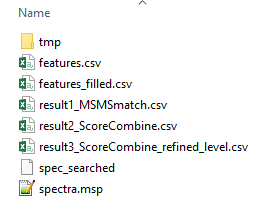

# Met4DX

## Introduction
`Met4DX` is an R package for versatile LC-IM-MS based 4D metabolomics data processing.Now Met4DX supports data processing for PASEF-DDA and PASEF-DIA data from timsTOF pro, and IM-AIF data from Agilent DTIM-MS 6560.

- For PASEF-DDA data, Met4DX is able to process data oriented from MS2 spectra or user-inputted precursor ion list. 
- Met4DX enables MS2 spectral generation directly from raw data without any other commercial software. 
- For PASEF-DIA data and IM-AIF data, Met4DX supports data processing with user-inputted precursor ion list. 
- We also provide a precursor ion list generated from various biological sample of both [positive](extra/precursor_ion_list/precursor_ion_list_pos.csv) and [negative](extra/precursor_ion_list/precursor_ion_list_neg.csv) modes.

The docker image [`zhulab/met4dx-r`](https://hub.docker.com/r/zhulab/met4dx-r) contains entire environment for running `Met4DX`. For convenience and taking fully use of `Met4DX`, users can pull it and run `Met4DX` just as following.

## What is Met4DX-r

`Met4DX-r` is a Docker environment to processing LC-IM-MS based 4D data with `Met4DX` R package. It is based on the [`r-base`](https://hub.docker.com/_/r-base/) docker.

## Pulling image

Users can pull the Met4DX-r image with the following script

```bash
docker pull zhulab/met4dx-r
```

## Data preparation

For data processing with different data acquisition methods and instruments, the data folder to run Met4DX should contains different data files. The R script must be named as "run.R"

- PASEF-DDA data (MS2 spectrum oriented, with MS2 spectra converted from DataAnalysis): The data folder should contain raw data files (.d), and a script. Demo files could be downloaded from [`https://doi.org/10.5281/zenodo.7215544`](https://doi.org/10.5281/zenodo.7215544).
  * raw data files (.d): the .d files containing .mgf file converted from DataAnalysis. If the samples contained different experimental conditions and groups, corresponding sub-folder could be built in the root folder.
  * R script: we provided demo [code](extra/PASEF_DDA_ms2_da/run.R), and the detailed parameters were explained in the script.
<br/><br>


- PASEF-DDA data (MS2 spectrum oriented, with MS2 spectra converted from GenerateMS2 function): The data folder should contain raw data files (.d), and a script. Demo files could be downloaded from [`https://doi.org/10.5281/zenodo.7215544`](https://doi.org/10.5281/zenodo.7215544).
  * raw data files (.d): the .d files. If the samples contained different experimental conditions and groups, corresponding sub-folder could be built in the root folder.
  * R script: we provided demo [code](extra/PASEF_DDA_ms2_raw/run.R), and the detailed parameters were explained in the script.
<br/><br>


- PASEF-DDA data (precursor ion list oriented): The data folder should contain raw data files (.d), a precursor ion list and a script. Demo files could be downloaded from [`https://doi.org/10.5281/zenodo.7215544`](https://doi.org/10.5281/zenodo.7215544).
  * raw data files (.d): the .d files. If the samples contained different experimental conditions and groups, corresponding sub-folder could be built in the root folder.
  * precursor ion list: a user-inputted precursor ion list containing ions of interests as the start points for bottom-up assembly 4D peak detection. And we provided demo files for both [positive](extra/precursor_ion_list/precursor_ion_list_pos.csv) and [negative](extra/precursor_ion_list/precursor_ion_list_neg.csv) modes.
  * R script: we provided demo [code](extra/PASEF_DDA_ion_list/run.R), and the detailed parameters were explained in the script.
<br/><br>


- PASEF-DIA data (precursor ion list oriented): The data folder should contain raw data files (.d), a precursor ion list and a script. Demo files could be downloaded from [`https://www.biosino.org/node/project/detail/OEP003846`](https://www.biosino.org/node/project/detail/OEP003846).
  * raw data files (.d): the .d files. If the samples contained different experimental conditions and groups, corresponding sub-folder could be built in the root folder.
  * precursor ion list: a user-inputted precursor ion list containing ions of interests as the start points for bottom-up assembly 4D peak detection. And we provided demo files for both [positive](extra/precursor_ion_list/precursor_ion_list_pos.csv) and [negative](extra/precursor_ion_list/precursor_ion_list_neg.csv) modes. 
  * R script: we provided demo [code](extra/PASEF_DIA_ion_list/run.R), and the detailed parameters were explained in the script.
<br/><br>

- IM-AIF data (precursor ion list oriented): The data folder should contain converted data files (.mzML format converted by ProteoWizard version 3.0.20360), a precursor ion list, a CCS calibration coefficient table and script. Demo files could be downloaded from [`https://www.biosino.org/node/project/detail/OEP003846`](https://www.biosino.org/node/project/detail/OEP003846).
  * raw data files (.mzML file): the .mzML files. If the samples contained different experimental conditions and groups, corresponding sub-folder could be built in the root folder.
  * precursor ion list: a user-inputted precursor ion list containing ions of interests as the start points for bottom-up assembly 4D peak detection. And we provided demo files for both [positive](extra/precursor_ion_list/precursor_ion_list_pos.csv) and [negative](extra/precursor_ion_list/precursor_ion_list_neg.csv) modes. 
  * CCS calibration coefficient table: containing the Tfix and Beta of each file. And we provided a demo [file](extra/IM_AIF_ion_lis/calibration_table.csv).
  * R script: we provided demo [code](extra/IM_AIF_ion_lis/run.R), and the detailed parameters were explained in the script.
<br/><br>
- For metabolite identification using demo library, a RT recalibration table is required. The demo file of [positive](extra/RT_recalibration_table/rt_pos.csv) and [negative](extra/RT_recalibration_table/rt_neg.csv) mode, and demo [code](extra/demo_library/run.R) were provided. 

- For metabolite identification using user-inputted library, tow msp file recording level1&2 metabolites and level3 metabolites are require. Demo file were provided. For [level 1&2](extra/user_library/level1_2_neg.msp) annotation, in the msp file, each compound must contain information listed below. The LABID must be nonredundant. RAW_ID is the source of the compound in the chemical database. LEVEL indicates the source of MS2 spectrum, of which 1 and 2 indicate that the MS2 spectrum was from experimental acquisition and the external library, respectively. PRECURSORMZ is the extract mass of the compound. FORMULA, SMILES, INCHI and INCHIKEY record the structural information of the compound. INCHIKEY1 is the first segment of INCHIKEY. KINGDOM, SUPERCLASS, CLASS and SUBCLASS are the chemical classes defined by ClassyFire. rt_OTHER records the RT of the compound and ccs_ADDUCT are the CCS values of different adduct forms. It is worth noting that MS2 spectra in positive and negative modes must be recorded in separated msp files and indicated in the ION_MODE. The MS2 spectrum is recorded with m/z and intensity of the specific fragment ion. The msp file for [level 3](extra/user_library/level3_neg.msp) annotation contains similar information. The LEVEL is 3 and the MS2 spectrum is recorded as 0 in this file. And the RT recalibration table is not required. 
<br/><br>

## Run data processing work with met4dx-r image

- go to your data folder (e.g., data)

```base
 cd data
```

- run docker using following code (*User should be permitted to run docker service*)

```bash
# MUST keep the code exactly as it is!
docker run -it --rm -v "$PWD":/data -u $(id -u ${USER}):$(id -g ${USER}) zhulab/met4dx-r Rscript run.R
```

- wait till data processing work done

- Explaining `docker run` arguments

- `-v "$PWD":/home/${USER}`: mapping current directory as home directory in docker container

- `-u $(id -u ${USER}):$(id -g ${USER})`: using current user to run the container

- `Rscript ~/run.R`: run run.R in container home directory with `Rscript`  command

## The result 

After the data processing work done, a folder name 'results' would be generated in the root folder. 



The main results are listed following:
- feature table named "features_filled.csv"
- MS2 spectral file named "spectra.msp" 
- the multidimensional match result named "result3_ScoreCombine_refined_level.csv"
- an intermediate data called "spec_searched", containing m/z, RT and CCS match candidates to run MS-FINDER (version 3.24).

To run additional MSFinder filtering, users can run the demo [scripts](extra/ForMSFinder/combine_final_result.R) and [MSFinder parameters](extra/ForMSFinder/MsfinderConsoleApp-Param.txt) provided here under Windows OS.
After running MS-FINDER and combining with "result3_ScoreCombine_refined_level.csv", users could obtain the final multidimensional match result named "ScoreCombine.csv" with the provided R script. In general, columns of “ScoreCombine.csv” included feature information, structural information of annotated metabolites, match errors in three dimensions (m/z, RT, CCS), match scores for RT match, CCS match, and MS2 spectral match, combined score, and the confidence level for metabolite annotation. Therefore, yes, each individual match score and the combined score were all outputted. Detailed explanations of the results are provided [here](extra/column_name.xlsx).
 
# License
<a rel="license" href="https://creativecommons.org/licenses/by-nc-nd/4.0/"></a>

This work is licensed under the Attribution-NonCommercial-NoDerivatives 4.0 International (CC BY-NC-ND 4.0)
